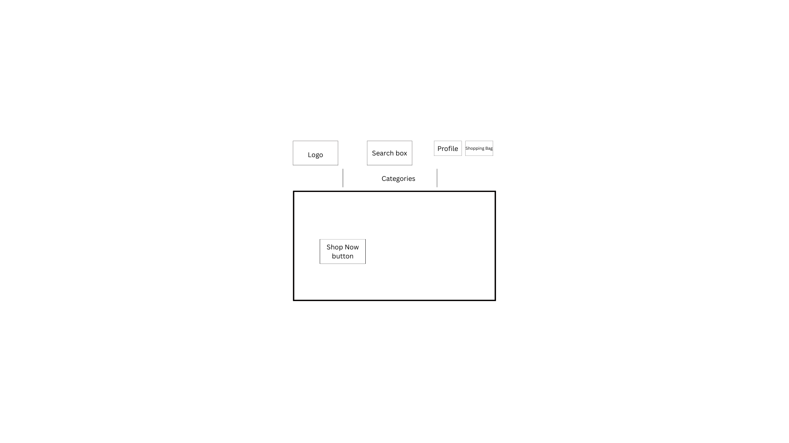
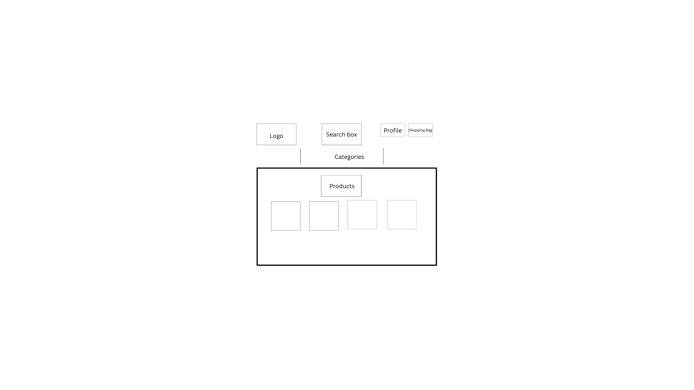
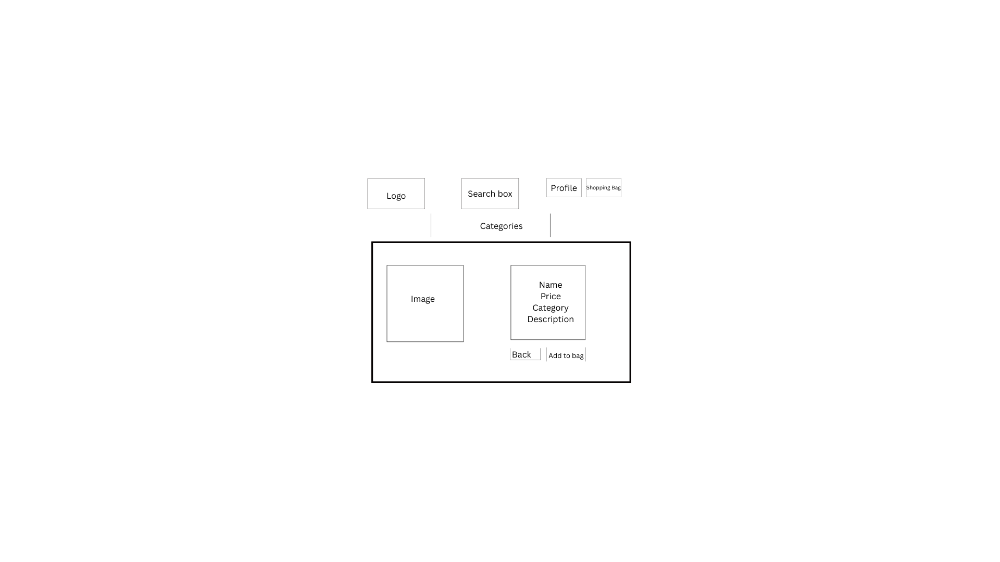
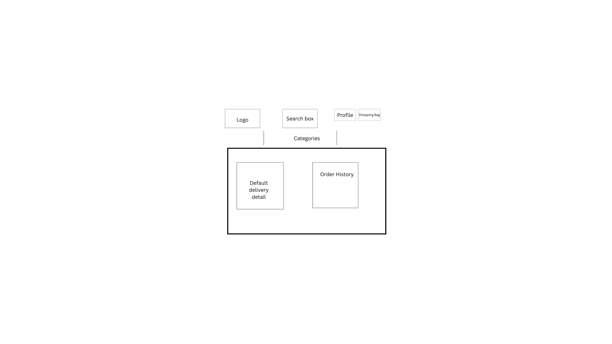
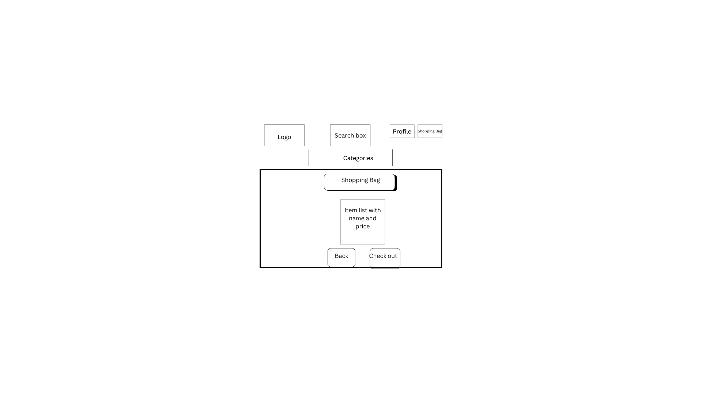
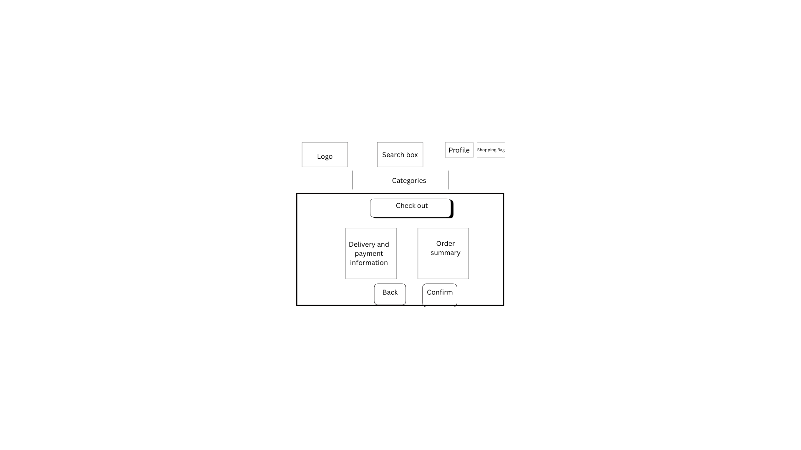
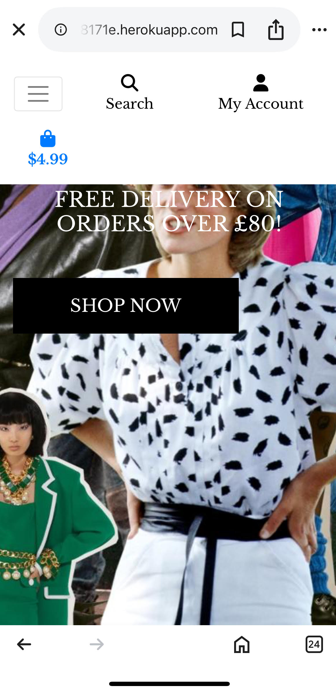

# project4 Vintage Shop

## Background information
Vintage Shop is a minimalist web application designed for selling vintage clothing and accessories. The site organizes products into clear categories, making it easy for users to browse unique items and place orders.

Admins can manage inventory by logging in as a superuser, with the ability to add, edit, or delete products through a simple interface.

### Goals
- External user’s goal: Browse and purchase unique vintage clothing and accessories with ease.
- Site owner's goal: Manage and sell vintage items efficiently.

### User stories
- First Time Visitor Goals
    1. As a First-Time Visitor, I want to quickly understand that this website sells vintage clothing and accessories.

    2. As a First-Time Visitor, I want to easily navigate the site to browse available products.

    3. As a First-Time Visitor, I want to view product details including images, names, prices, categories, and descriptions.

- Returning Visitor Goals
    1. As a Returning Visitor, I want to search for products by category or by using the search bar.

    2. As a Returning Visitor, I want to add unique items to my shopping bag with a single click (no size or quantity selection needed because everything only has one piece available).

    3. As a Returning Visitor, I want to create an account to save my delivery details and view past orders.

    4. As a Returning Visitor, I want to log in and out of my account securely.

    5. As a Returning Visitor, I want to check my shopping bag before making a purchase.

    6. As a Returning Visitor, I want to complete the checkout process easily, including providing delivery information and making payment.

    7. As a Returning Visitor, I want to view my order history and saved delivery details in my profile.

- Frequent Visitor Goals
    1. As a Returning Visitor, I want to search for products by category or by using the search bar.

    2. As a Returning Visitor, I want to add unique items to my shopping bag with a single click (no size or quantity selection needed).

    3. As a Returning Visitor, I want to create an account to save my delivery details and view past orders.

    4. As a Returning Visitor, I want to log in and out of my account securely.

    5. As a Returning Visitor, I want to check my shopping bag before making a purchase.

    6. As a Returning Visitor, I want to complete the checkout process easily, including providing delivery information and making payment.

    7. As a Returning Visitor, I want to view my order history and saved delivery details in my profile.

- Site Owner Goals
    1. As the Site Owner, I want to add new vintage items to the store through the admin interface.

    2. As the Site Owner, I want to edit or delete products when necessary.

    3. As the Site Owner, I want sold items to automatically disappear from the shop, since each product is one-of-a-kind.

    4. As the Site Owner, I want a simple, clean layout that doesn’t require tracking quantity or size.

## Features

### Homepage Features

- **Eye-Catching Background Image**: The homepage features a striking, vintage-style background image that sets the tone for the website and captures the user's attention instantly.

- **Website Branding (Top Left)**: The site name is displayed clearly on the top left corner of the page, giving users an immediate sense of identity.By clicking it, users will be redirected to homepage anytime.

- **User Account (Top Right)**: On the top right corner, users can access their account. These options are consistently available across all pages for easy access.

- **Shopping Bag** On the top right corner, users can view their shopping bag at any time. 

- **Search Functionality**: A search box is prominently in the middle of the header, allowing users to quickly find vintage items they’re looking for. This feature remains visible across the entire site.

- **Category Navigation**: Dropdown menus for **Clothing** and **Accessories** allow users to filter items by category. These menus are available on every page to support seamless browsing.

- **Shop Now**: This button leads users to a page of all products.

### Products Page
- View all products with image, name, price, and category.
- Filter products by category using dropdowns.
- Search for products using keywords.
- Click on any item to view detailed information on the product detail page.
- If user is a superuser, they can see edit and delete options to each item.

### Product Detail Page
- View single product with image, name, price, category and descriptions.
- Add products to shopping bag.
- Go back to all products page to keep shopping.
- If user is a superuser, they can see edit and delete options to each item.

### Shopping Bag
- Add unique items to the bag (each product can only be added once).
- View contents of the bag from any page.
- Proceed to checkout or continue shopping.

### Checkout
- Fill in delivery details.
- Secure payment integration via Stripe.
- Order confirmation page on successful checkout.

### User Accounts
- Register for a new account.
- Sign in and out securely.
- Access personal profile with:
  - Default delivery info
  - Order history

### Site Management (Admin)
- Superusers can add, edit, or delete products through the Django admin panel.
- Product info includes name, category, description, price, image, and SKU.

## Techonologies Used

### Frontend
- **HTML** – Structure and content of the website
- **CSS** – Styling and responsive layout
- **JavaScript** – Basic interactivity

### Framework & Core Libraries
- **Django 3.2.25** – Python web framework used for backend development
- **Gunicorn 23.0.0** – WSGI HTTP Server for running Django in production
- **dj-database-url 0.5.0** – Simplifies database configuration from environment variables

### Authentication
- **django-allauth 0.50.0** – Handles user registration, login, and third-party authentication
- **PyJWT 2.10.1** – JSON Web Token authentication
- **oauthlib 3.2.2** / **requests-oauthlib 2.0.0** – OAuth support for authentication

### Forms & Templates
- **django-crispy-forms 1.14.0** – Better control over form rendering

### AWS & Static/Media File Handling
- **boto3 1.37.37** / **botocore 1.37.37** / **s3transfer 0.11.5** – AWS SDK for Python
- **django-storages 1.14.6** – Integration for storing static/media files on AWS S3

### Image Processing
- **Pillow 10.3.0** – Python Imaging Library fork for handling image uploads

### Database
- **psycopg2 2.9.10** – PostgreSQL adapter for Python

### Security
- **cryptography 44.0.1** / **cffi 1.17.1** / **pycparser 2.22** – Libraries for encryption and cryptographic primitives
- **defusedxml 0.7.1** – Safer XML handling to avoid vulnerabilities

### Utilities & Parsing
- **sqlparse 0.5.3** – SQL parser used by Django
- **python-dateutil 2.9.0.post0** – Date handling beyond built-in `datetime`
- **pytz 2025.1** – Timezone support
- **packaging 25.0** / **typing_extensions 4.13.1** – Python typing and packaging helpers

### HTTP & Networking
- **requests 2.32.3** – For making HTTP requests
- **urllib3 2.3.0** / **idna 3.10** / **charset-normalizer 3.4.1** – Dependencies of `requests`

### Payments
- **stripe 12.0.0** – Payment processing integration

### Deployment
- **Heroku** – Cloud platform used to deploy the Django app
- **AWS S3** – Used for storing static and media files

### Development Tools
- **Visual Studio Code (VS Code)** – Primary code editor
- **Git & GitHub** – Version control and code hosting

## Design

### Project Structure

The project is built using Django and follows a modular app-based structure. The main custom apps include:

- **home** – Handles the homepage and overall layout
- **products** – Manages product listings and product details
- **bag** – Implements shopping bag functionality
- **checkout** – Handles checkout, payment, and order confirmation
- **profiles** – Manages user profiles, order history, and default delivery info

### Color Scheme

- **Primary Colors:**
  - **Black**: Used for key elements such as buttons (`.shop-now-button`, `.btn-black`) and text (`.text-black`). This creates a bold, high-contrast look that emphasizes important actions and ensures readability against the vintage-style background.
  - **White**: Applied to the background overlay (`.overlay`), button text, and various other elements. White offers a clean, minimalist contrast that aligns with the vintage aesthetic and provides visual balance.

- **Button Colors:**
  - **Outline Button**: `.btn-outline-black` has a **white background** with a **black border** and **black text**. On hover, it reverses to provide a more interactive and engaging visual experience. This style is chosen to maintain a sleek, modern look while aligning with the overall color scheme.

### Typography
- **Font Family**: The site uses `'Libre Baskerville', serif`, which is a sophisticated and classic typeface. The choice reflects the vintage nature of the shop, providing a sense of elegance and timelessness that complements the product offering.
- **Text Color**: The default text color is **light grey (#555)** for readability, offering a softer, less stark contrast compared to pure black. This creates a more comfortable reading experience while still maintaining legibility.
- **Font Size**: Font sizes are set to be legible and user-friendly, ensuring a balance between aesthetics and functionality. Headings and buttons have slightly larger font sizes for emphasis and better user engagement.

### Wireframe

Below is the wireframe for this project:

- **Home page**

- **Products page**

- **Product detail page**

- **Profile page**

- **Shopping bag page**

- **Check out page**

## Testing
### Homepage
This test ensures that all key elements on the homepage work correctly, including logo, search box, two category dropdowns, my account and shoping bag.The header is visible and styled correcrtly on all screen sizes.
#### Logo
- Clicking the logo redirects the user to the homepage.

#### Search Box
- Users can type into the search box.
- Submitting a query redirects to the products page with relevant results.

#### Category Dropdowns
- The Clothing and Accessories dropdown menus are functional.
- Clicking a category link redirects to the filtered product list.
- Menus collapse/expand correctly on all screen sizes.

#### My Account Links
- The link is visible in the navbar.
- It is linked to product management, signin/signout, and my profile.
- Redirects appropriately depending on whether the user is logged in or not:
  - Not Logged in: goes to the login/register page.
  
  **Register button**
  
  **Sign in button**
  
  - Logged in: goes to the profile page.
  
  **My Profile button**
  
  
  **Sign out button**
  
#### Shopping Bag Icon
- Clicking the icon redirects to the shopping bag page.
- Accurately displays total price if the bag is not empty.

#### Shop Now Button
- A "Shop Now" button is present on the homepage and links correctly to the products listing page.

### Register
When signing up for the website, email confirmation is required.

Once confirmed, user will be redirected back to home page.

### Product Page
This test ensures that all key elements on the product listing page are displayed correctly and link to the appropriate product detail pages.
#### Product Listings
- All products are displayed on the page.  
- Each product includes the **name**, **price**, and **category**.  
- Product images are shown.

- **Navigation to Product Detail**
- Clicking on a product image or name redirects the user to the corresponding **product detail page**. 
 

### Product Detail Page

This test ensures that each individual product detail page displays the correct product information and provides functional interaction options.

#### Product Information
- The **product name**, **price**, **category**, and **description** are clearly displayed.
- The product image is shown correctly, or a placeholder appears if no image is uploaded.

#### Action Buttons
- **Add to Bag** button:
  - Clicking it adds the product to the shopping bag.
  - The shopping bag icon updates with the correct item count.

- **Keep Shopping** button:
  - Clicking it returns the user to the product listing page.
 

### Shopping Bag Page

This test ensures that all elements on the shopping bag page display correctly and work as intended.
#### Bag Contents
- Each item in the bag is listed with:
  - **Product name**
  - **Price**
  - **Remove** button

#### Action Button
- **Remove** button:
- Clicking the **Remove** button removes the item from the bag and updates the total accordingly.

- **Keep Shopping** button:
  - Redirects to the product listing page (`products` page).
- **Secure Checkout** button:
  - Redirects to the checkout page to complete the purchase.

### Check Out Page

This test ensures that all elements of the checkout process work as intended and that the page functions properly depending on user login status.
#### Form Fields
- Customer name, email address, delivery address, and payment details are all present.
- All form fields are required and validate user input.
- Appropriate error messages appear for missing or invalid fields.
#### Order Summary
- Displays all items in the bag with:
  - Product names
  - Individual prices
- Delivery fee is shown clearly.
- Total price (including delivery) is calculated correctly.

#### Login Requirement
- If the user is **not logged in**, they are prompted to:
  - Log in, or
  - Create an account
- Once authenticated, they are redirected back to the checkout page with their bag contents preserved.

#### Order confirmation
Once delivery and paytment information is filled, user will be directed to a confrimation page by clicking **Complete order** buttoon.

### Product management

#### Add Product
From My Account, when Product Management clicked, users are directed to Add a Product page.

#### Edit Product&Delete Product
- On both product page and product detail page, if the user is a super user, there is a button of edit and a button of delete.

- If edit button is clicked, users will be redirected to edit page where product details can be ajusted.

### Home page on other screens
-**Mobile**

-**Smaller screens**

### Report Issues
- **Contact:** Email [wendytanvalencia@gmail.com].

## Bug

### 1. Backgrond picture path
- **Problem**: Background image wasn’t showing.
- **Cause**: The file, like other product pictures, was located in media folder.
- **Solution**: Removed file to css folder.

### 2. Collectstatic command failure
- **Problem**:a 404 Not Found error when trying to access an object on S3.
- **Cause**: S3 Bucket Permissions incorrect.
- **Solution**:Changed files permission to read.

### 3. Secret key missing
- **Problem**:Error: The SECRET_KEY setting must not be empty.
- **Cause**: secret key was not set in settings.py.
- **Solution**: Add a line to settings.py, SECRET_KEY = os.environ.get("SECRET_KEY", "my-dev-secret-key").

### 4. Static file deployment failure
- **Problem**:Heroku threw an error: Unable to generate Django static files.
 !     
 !     The 'python manage.py collectstatic --noinput' Django
 !     management command to generate static files failed.'
- **Cause**:Original settings don’t fully account for the local filesystem fallback, which Django expects if USE_AWS is not set in the environment.
- **Solution**: Add a line to settings.py, if 'USE_AWS' not in os.environ:
    STATIC_ROOT = os.path.join(BASE_DIR, 'staticfiles')

### 5. Static file deployment failure
- **Problem**: 404 Error: /static/css/base.css
- **Cause**:base.css didn't exist at the correct path.
- **Solution**: Moved base.css to the correct folder.

### 6. Module name wrong
- **Problem**: ModuleNotFoundError: No module named 'project_4_vintageshop'.
- **Cause**: In Procfile,  it was written 'web: gunicorn project_4_vintageshop.wsgi:application' whereas actual app folder is named vintageshop.
- **Solution**: Corrected it to 'web: gunicorn vintageshop.wsgi:application'.

### 7. Python version
- **Problem**:Error: Invalid Python version in .python-version.
- **Cause**: It was written 3.12.9 in .python-version file.
- **Solution**: Rewrote it to 3.12.

### 8. Fixture files missing.
- **Problem**:UnicodeDecodeError: 'utf-8' codec can't decode byte 0xff in position 0: invalid start byte
- **Cause**: Manually updated categories products as admin but didn't have categories.json nor products.json.
- **Solution**: Ran python manage.py dumpdata products.Product --indent 2 > products/fixtures/products.json
python manage.py dumpdata products.Category --indent 2 > products/fixtures/categories.json

### 9. Package missing
- **Problem**:NameError: name 'dj_database_url' is not defined
- **Cause**: Didn't import the dj_database_url package before using it.
- **Solution**: In settings.py, ran 'import dj_database_url'.

### 10. Product page error
- **Problem**: Reverse for 'edit_product' with arguments '('',)' not found.
- **Cause**: In <form action="" method="post"> , it was written ' product_id' instead of 'product.id'.
- **Solution**: Corrected it to 'product.id'.

### 11. Register error
- **Problem**: UNIQUE constraint failed: profiles_userprofile.user_id
- **Cause**: Could be signing up with different accounts from the same computer for testing.
- **Solution**: Downloaded a new browser and signed up successfully.

### 12. Layout error
- **Problem**:Logout/confirmation message was within header area.
- **Cause**: Affected by general css rules.
- **Solution**: Added a unique class or ID to the body tag on the logout page and adjust the location.

### 13. Delete button not working as expected.
- **Problem**:  It gave an empty page whereas it should redirect to product.html.
- **Cause**:remove_from_bag view function set wrong.
- **Solution**:Use POST method with form and redirect back to the bag view

### 14. Account error
- **Problem**:Page not found (404) No UserProfile matches the given query.
- **Cause**: The logged-in user doesn’t have a UserProfile yet
- **Solution**:Update view to Create a UserProfile if one doesn’t exist.

## Deployment
This application is hosted on Heroku.

You can access it directly by visiting the following URL:https://vintageshop-c46276b8171e.herokuapp.com/

## Version Control
This project uses Git for version control. 
- **Repository**: The project is maintained in a Git repository, which helps track changes and manage the project’s history.
- **Commits**: Changes are committed with descriptive messages to keep track of modifications and updates.
- **Commit Messages**: Descriptive commit messages are used to explain the purpose of each change.
- **Main Branch**: The `main` branch represents the latest stable version of the project. All final changes are merged into this branch.

## Credits

- **background image** - Image source:[Vogue Austrilia](https://www.vogue.com.au/shopping/80s-fashion-women/news-story/08c40105289d7f4ee15cc7449a28e541)

- The struction of this project is inspired by Walkthrough Projuct Boutique Ado from [Code Institute].